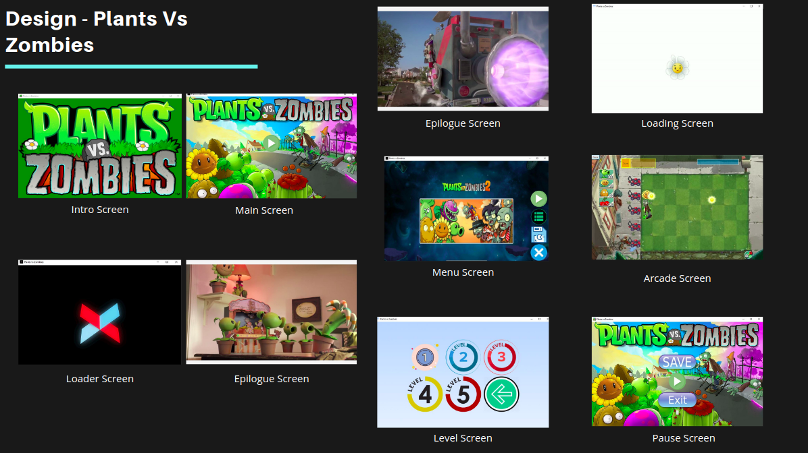

## Plants Vs. Zombies
Implemented a complete and functioning game inspired by Plants vs Zombies in java, comprising of 5 Levels. The game was developed using JavaFX and employs multithreading, and a handful of design patterns.

## Getting Started
This project is not a standalone executable and thus requires the latest JDK and JavafX to be installed on system before you run the game, Thus use a IDE for doing the same. (Preferably IntelliJ - in which it was originally designed and developed)

## Design
We have incorporated various design patterns in our javafx based Plants Vs Zombies game including:

- Adapter design pattern is inclusive in the communication and interaction between the backend logic and the GUI of the game, controller functions help to communicate between the two.
- State Design pattern: The state of the game elements( Screen , backyard , zombie etc.) keep changing their behaviour in different situations.
Factory Design pattern: Whenever a plant is dragged or a pea is shooted, or a zombie is created , an object creation mechanism takes place that develops new objects for each type.
- Observer: There are many components in the game that are dependent on the state of other objects and their behaviour, for eg. the scoreboard that depends on how many zombies are being killed and other states of the backyard.

## How Game LOOKS :)

We have implemented our game using javafx for communication with the GUI elements. Here’s a brief runthrough.

Main screen is started. 3 option buttons are provided for loading game, starting new , choosing level.
- As the user chooses the button an event handler is called for the respective button and the control is transferred to the next required screen.
- Saving is achieved through serialization of the PlantsVsZombies class object. Which is loaded into a file.
- Image view, labels, text boxes, Grid panes etc. are used to implement gui units in the game
- Sound effects are added
- 5 Different Levels are implemented with increasing difficulty.
- 4 different types of plant classes and three different zombies have been implemented.

You can look at our implementation here.

## Built With
- Java
- JavaFX

## Version Info
- Version : 1.0.1

## Authors
- Ujjwal Singh - IIIT-Delhi
- Ishan Kapur - IIIT-Delhi
